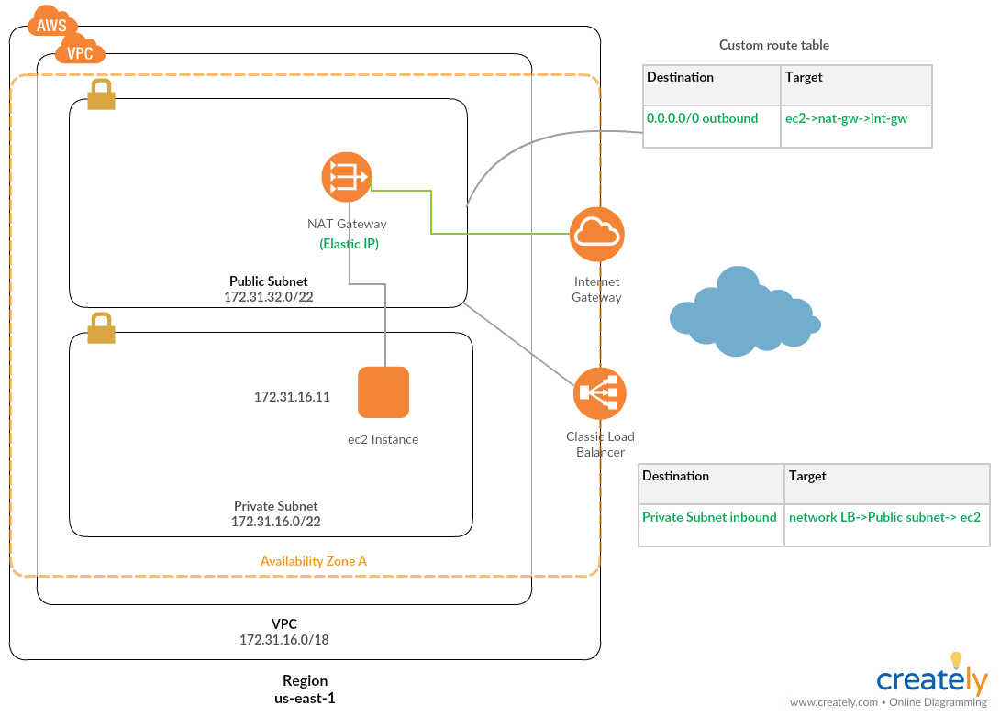
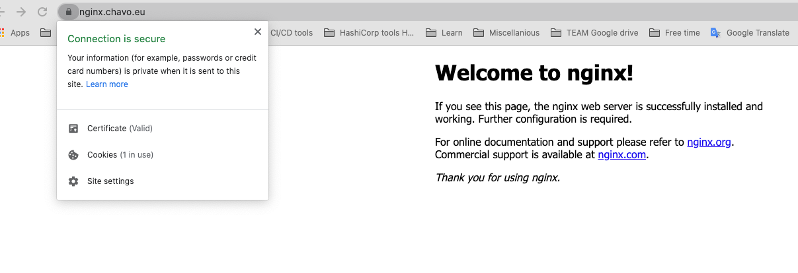

# Terraform module that will create a VPC on AWS with two subnets - Public and Private and network Load Balancer for inbound connection
- Private subnet have an outbound route to the Public network - nat_gateway.
- Public subnet have a route to the Internet Gateway
- Private network should have inbound connection trough the network Load Balancer

## Overview



## How to use it:
```
git clone https://github.com/chavo1/nginx-aws-lb-terraform.git
cd nginx-aws-lb-terraform
terraform init
terraform apply
ssh ubuntu@nginx.chavo.eu
```

## Let's install NGINX and some application and make it NGINX available over https
```
sudo apt update
sudo apt install -y vim curl certbot nginx
```
### You can continue with [this guide](https://github.com/chavo1/terraform-nginx-aws)
## The result should be:



### Do not forget to destroy the environment:
`terraform destroy`
